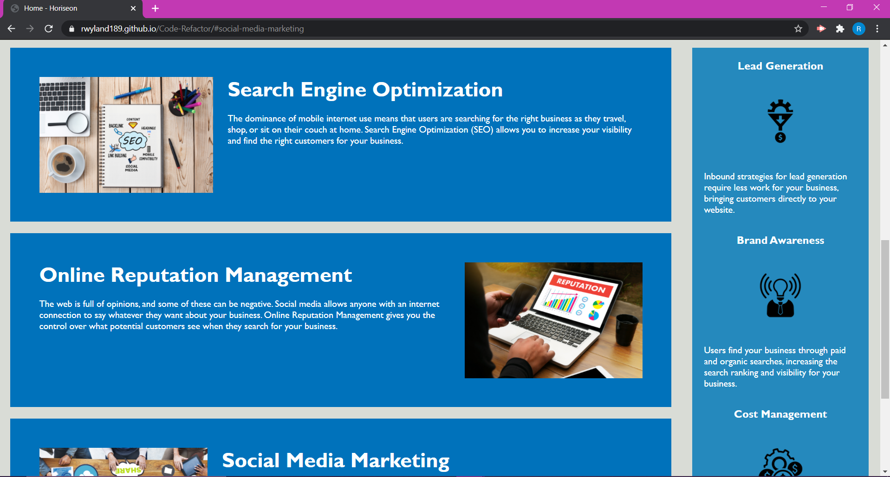
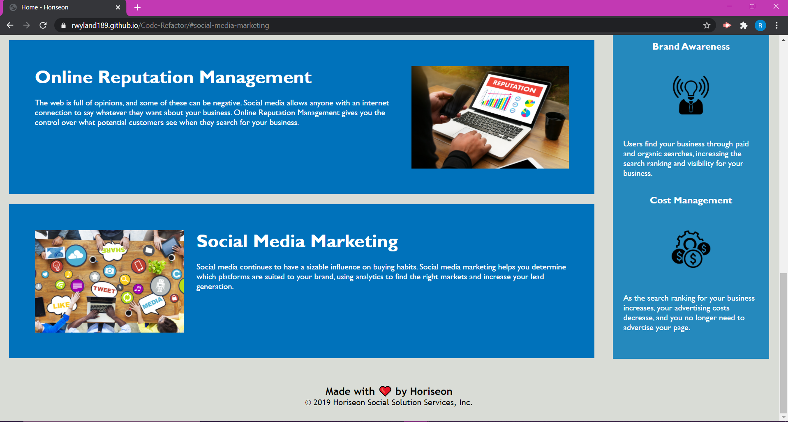

# Code-Refactor

## Purpose
Refactor existing code of a website for improved accessibility and long-term sustainability.

## Built With
* HTML
* CSS

## Website
https://rwyland189.github.io/Code-Refactor/

## Screenshots

## Contribution
Made by Becca Wyland